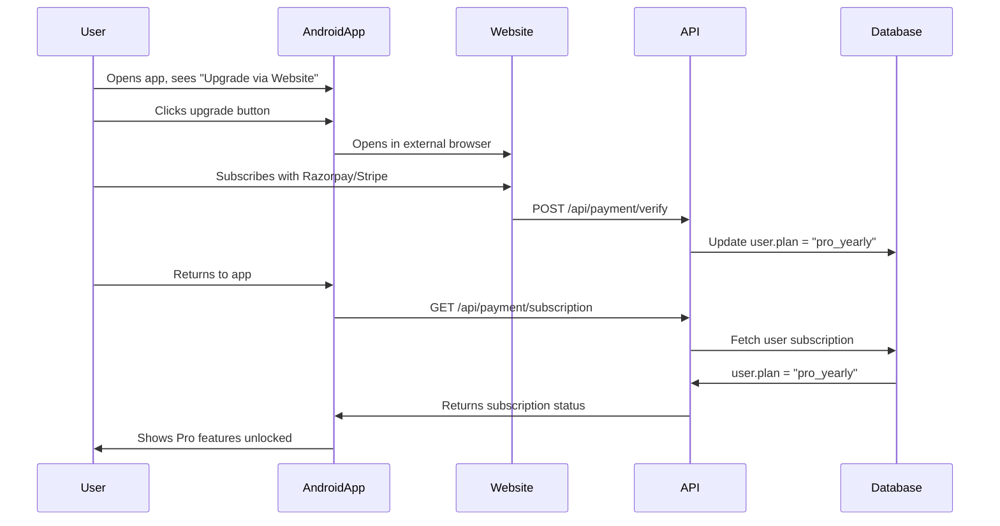

# Platform Detection System

## Overview

ConsistencyGrid uses a platform detection system to provide different user experiences for web and Android app users, specifically to comply with Google Play Store policies regarding in-app payments.

## Strategy

### Problem
Google Play Store charges 15-30% commission on all in-app purchases made through their payment system.

### Solution
- **Web Users**: Full payment functionality with Razorpay/Stripe integration
- **Android App Users**: Payment UI hidden, users directed to website for subscriptions
- **Subscription Sync**: Subscriptions purchased on website automatically sync to Android app

This is the same strategy used by major apps like Netflix, Spotify, and Kindle.

## Architecture

### Detection Methods

The platform detection system uses multiple methods to reliably identify Android WebView:

1. **User Agent Analysis**
   - Checks for WebView-specific patterns in `navigator.userAgent`
   - Pattern: `/webview|wv|android.*applewebkit(?!.*chrome)/i`

2. **Android Interface Injection** (Optional)
   - Detects custom JavaScript interface injected by Android app
   - Check: `typeof window.Android !== 'undefined'`

3. **Platform Flag** (Recommended)
   - Uses localStorage flag set by Android app on initialization
   - Key: `consistencygrid_platform` = `'android'`

### Core Module

**File**: `src/lib/platform-utils.js`

Key functions:
- `isAndroidApp()` - Detects if running in Android WebView
- `shouldShowPaymentUI()` - Determines if payment UI should be shown
- `getUpgradeUrl()` - Returns appropriate upgrade URL for platform
- `openUpgradePage()` - Opens upgrade page with platform-appropriate method

## Implementation Guide

### 1. Basic Usage

```javascript
import { shouldShowPaymentUI, isAndroidApp } from '@/lib/platform-utils';

export default function MyComponent() {
  if (shouldShowPaymentUI()) {
    return <PaymentButton />;
  }
  
  return <UpgradeViaWebsiteButton />;
}
```

### 2. Conditional Rendering

```javascript
import { shouldShowPaymentUI } from '@/lib/platform-utils';

{shouldShowPaymentUI() ? (
  <div className="payment-section">
    <h3>Choose Your Plan</h3>
    <PricingCards />
  </div>
) : (
  <div className="upgrade-section">
    <h3>Upgrade to Pro</h3>
    <p>Visit our website to subscribe</p>
    <button onClick={() => window.open('https://consistencygrid.com/pricing', '_blank')}>
      Open Website
    </button>
  </div>
)}
```

### 3. Platform-Specific Navigation

```javascript
import { openUpgradePage } from '@/lib/platform-utils';

<button onClick={openUpgradePage}>
  Upgrade Now
</button>
```

### 4. Platform Messages

```javascript
import { getPlatformMessages } from '@/lib/platform-utils';

const messages = getPlatformMessages();

<button>{messages.upgradeButton}</button>
<p>{messages.upgradeDescription}</p>
```

## Android Integration

### Setting Platform Flag

In your Android WebView initialization code (Kotlin/Java):

```kotlin
// MainActivity.kt or WebInterface.kt
webView.evaluateJavascript("""
  (function() {
    try {
      localStorage.setItem('consistencygrid_platform', 'android');
      console.log('Platform marked as Android');
    } catch (e) {
      console.error('Failed to set platform flag:', e);
    }
  })();
""", null)
```

### Optional: JavaScript Interface

For more robust detection, inject a custom interface:

```kotlin
class AndroidInterface(private val context: Context) {
    @JavascriptInterface
    fun getPlatform(): String {
        return "android"
    }
}

// Add to WebView
webView.addJavascriptInterface(AndroidInterface(this), "Android")
```

Then in JavaScript:
```javascript
if (typeof window.Android !== 'undefined') {
  console.log('Running in Android app');
}
```

## Modified Components

The following components have been updated to use platform detection:

### Payment Components
- `src/components/payment/PaymentCheckout.js` - Hides payment button in Android
- `src/app/pricing/page.js` - Shows different UI for Android users

### Navigation
- `src/components/layout/Navbar.js` - Platform-aware pricing link

### Settings
- `src/app/settings/page.js` - Platform-aware subscription management

### Utilities
- `src/lib/subscription-utils.js` - Platform-aware upgrade URLs

## Testing

### Test in Web Browser

1. Open DevTools (F12)
2. Navigate to Application > Local Storage
3. Verify no `consistencygrid_platform` key exists
4. Verify payment UI is visible

### Test Android Detection Locally

1. Open DevTools (F12)
2. Run in console:
   ```javascript
   localStorage.setItem('consistencygrid_platform', 'android');
   location.reload();
   ```
3. Verify payment UI is hidden
4. Verify "Upgrade via Website" button appears

### Test in Android App

1. Build and install app on device
2. Navigate to Pricing page
3. Verify payment UI is hidden
4. Click "Upgrade via Website" button
5. Verify external browser opens with website

### Clear Platform Flag

```javascript
localStorage.removeItem('consistencygrid_platform');
location.reload();
```

## Debugging

### Enable Platform Logging

```javascript
import { logPlatformInfo } from '@/lib/platform-utils';

// In your component or useEffect
useEffect(() => {
  logPlatformInfo();
}, []);
```

This will log:
- Current platform (web/android)
- User agent string
- Detection method results
- Upgrade URL
- Platform flags

## Play Store Compliance

### ✅ Compliant Practices

- No payment UI in Android app
- No pricing information displayed in app
- Users directed to external website for subscriptions
- Subscription status syncs automatically
- No mention of "cheaper on website"

### ❌ Non-Compliant Practices (Avoid)

- Showing prices in Android app
- Processing payments in Android app
- Telling users "save money by subscribing on website"
- Using in-app browser for payment (use external browser)

## Subscription Sync Flow



## FAQs

### Q: Will this work if user is not logged in?

A: The user must be logged in on both website and app with the same account for subscription to sync. Ensure session persistence is working correctly.

### Q: How long does subscription sync take?

A: Instant. The app fetches subscription status from the API on every app launch and when navigating to premium features.

### Q: Can we show a "Pro" badge in the app?

A: Yes! You can show feature availability and subscription status. Just don't show pricing or payment options.

### Q: What if Play Store rejects the app?

A: This strategy is widely used and compliant. If rejected, ensure:
- No payment UI anywhere in app
- No pricing information visible
- External browser opens (not in-app browser)
- No "save money" messaging

### Q: Can we add a "Restore Purchase" button?

A: Not needed! Subscription status is fetched from your backend, not from Play Store. It syncs automatically.

## Support

For issues or questions:
- Check logs with `logPlatformInfo()`
- Verify localStorage flag in Android app
- Test user agent detection
- Ensure session persistence works

## References

- [Google Play Payments Policy](https://support.google.com/googleplay/android-developer/answer/9858738)
- [Netflix Android App Strategy](https://www.theverge.com/2018/12/28/18158778/netflix-subscription-ios-android-app-store)
- [Spotify Payment Strategy](https://newsroom.spotify.com/2022-03-24/spotify-is-rolling-out-a-new-simplified-sign-up-experience/)
